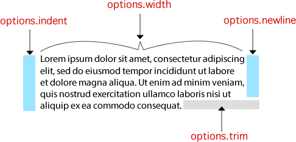

# deno_word_wrap

[](https://github.com/justjavac/deno_word_wrap/releases)
[](https://github.com/justjavac/deno_word_wrap/actions)
[](https://github.com/justjavac/deno_word_wrap/blob/master/LICENSE)

Wrap words to a specified length.

> base on [jonschlinkert/word-wrap](https://github.com/jonschlinkert/word-wrap)

## Usage

```js
import wrap from 'https://deno.land/x/word_wrap/mod.ts';

wrap('Lorem ipsum dolor sit amet, consectetur adipiscing elit, sed do eiusmod tempor incididunt ut labore et dolore magna aliqua. Ut enim ad minim veniam, quis nostrud exercitation ullamco laboris nisi ut aliquip ex ea commodo consequat.');
```

Results in:

```
Lorem ipsum dolor sit amet, consectetur adipiscing
elit, sed do eiusmod tempor incididunt ut labore
et dolore magna aliqua. Ut enim ad minim veniam,
quis nostrud exercitation ullamco laboris nisi ut
aliquip ex ea commodo consequat.
```

## Example

```bash
deno run https://deno.land/x/word_wrap/example.ts
```

## Options



### options.width

Type: `Number`

Default: `50`

The width of the text before wrapping to a new line.

**Example:**

```ts
wrap(str, {width: 60});
```

### options.indent

Type: `String`

Default: `""` (none)

The string to use at the beginning of each line.

**Example:**

```ts
wrap(str, {indent: '      '});
```

### options.newline

Type: `String`

Default: `\n`

The string to use at the end of each line.

**Example:**

```ts
wrap(str, {newline: '\n\n'});
```

### options.escape

Type: `function`

Default: `function(str){return str;}`

An escape function to run on each line after splitting them.

**Example:**

```ts
wrap(str, {
  escape: function(str: string): string {
    return str.toUpperCase();
  }
});
```

### options.trim

Type: `Boolean`

Default: `false`

Trim trailing whitespace from the returned string. This option is included since `.trim()` would also strip the leading indentation from the first line.

**Example:**

```ts
wrap(str, {trim: true});
```

### options.cut

Type: `Boolean`

Default: `false`

Break a word between any two letters when the word is longer than the specified width.

**Example:**

```ts
wrap(str, {cut: true});
```

## License

[deno_word_wrap](https://github.com/justjavac/deno_word_wrap) is released under the MIT License. See the bundled [LICENSE](./LICENSE) file for details.
